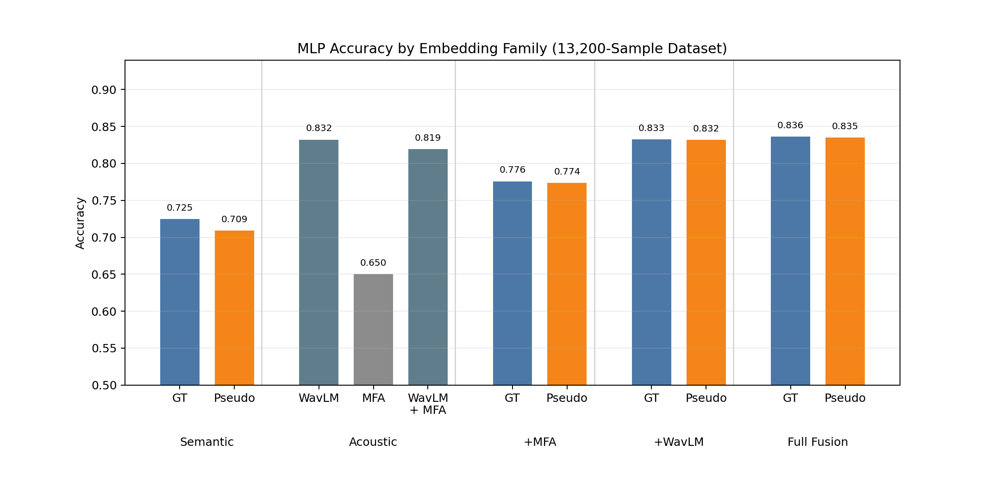
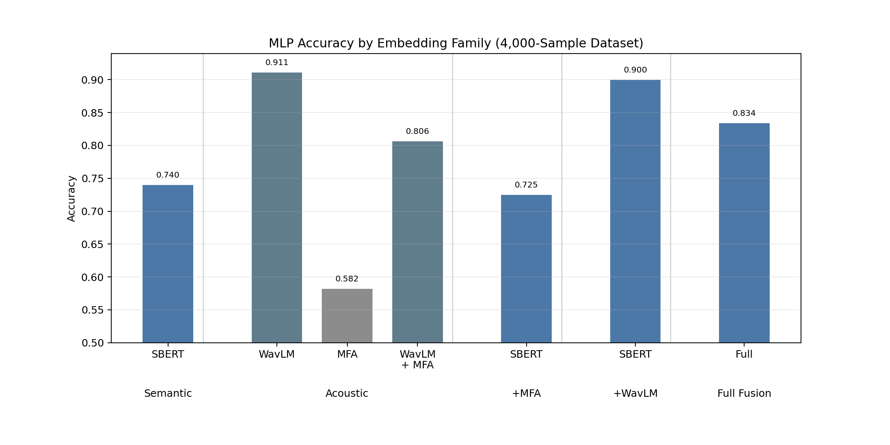

# Embedding Comparison for Domain-Aware ASR Data Selection

## Overview

This report documents an embedding-comparison experiment for domain-aware automatic speech recognition (ASR) data selection. The experiment evaluates how well semantic, acoustic, and fused utterance-level embeddings distinguish four speech domains using a supervised multilayer perceptron (MLP) classifier.

The main comparison studies semantic embeddings derived from:

1. ground-truth transcripts; and
2. Whisper large-v3 pseudo-labels.

The 13,200-sample experiment extends an earlier 4,000-sample baseline with a larger candidate set and explicit ground-truth-versus-pseudo-label semantic comparisons.

## Dataset

### Domains

The experiment uses four speech domains:

| Domain      | Source dataset                        | Reference source split | Candidate source split |
| ----------- | ------------------------------------- | ---------------------- | ---------------------- |
| GigaSpeech  | `pengyizhou/gigaspeech_subset_270h` | `test`               | `train`              |
| IMDA        | `pengyizhou/nsc-imda-part6`         | `test`               | `train`              |
| LibriSpeech | `openslr/librispeech_asr`           | `test.clean`         | `train.clean.100`    |
| Svarah      | `ai4bharat/Svarah`                  | `test`               | `test`               |

Svarah exposes only a `test` split. Reference and candidate rows are sampled from that split without selected-sample overlap.

### Filtering and splits

Utterances are filtered before selection:

- minimum transcript length: 3 words;
- minimum audio duration: 3.0 seconds.

The selected subset contains 13,200 utterances:

| Role            | Rows per domain |       Total rows |           Duration |
| --------------- | --------------: | ---------------: | -----------------: |
| Reference       |             300 |            1,200 |            2.724 h |
| Candidate       |           3,000 |           12,000 |           29.720 h |
| **Total** | **3,300** | **13,200** | **32.444 h** |

Reference rows are used as the supervised MLP training set. Candidate rows are used as the evaluation set:

```text
reference -> train.npy
candidate -> test.npy
```

Each domain contributes equally to both roles:

| Domain      | Reference rows | Candidate rows | Total rows |
| ----------- | -------------: | -------------: | ---------: |
| GigaSpeech  |            300 |          3,000 |      3,300 |
| IMDA        |            300 |          3,000 |      3,300 |
| LibriSpeech |            300 |          3,000 |      3,300 |
| Svarah      |            300 |          3,000 |      3,300 |

## Whisper Pseudo-Labels

Candidate and reference audio are transcribed with Hugging Face Transformers using:

| Setting         | Value                       |
| --------------- | --------------------------- |
| Model           | `openai/whisper-large-v3` |
| Task            | `transcribe`              |
| Language prompt | `english`                 |
| Batch size      | 8                           |
| Chunk length    | 30 seconds                  |
| Chunk stride    | 5 seconds                   |
| GPU precision   | FP16 when CUDA is available |

Chunking is enabled to support utterances longer than Whisper's standard 30-second input window. The pseudolabel process is resumable through a JSONL checkpoint keyed by `utt_id`.

The generated manifest preserves the original metadata and adds:

```text
pseudo_transcript
pseudo_transcript_norm
pseudo_model
pseudo_status
pseudo_error
```

One IMDA candidate utterance (`im_candidate_0822`) produced punctuation-only Whisper output. Its normalized pseudolabel was empty. To preserve the fixed 13,200-row subset, that row uses its ground-truth normalized transcript as a documented manual fallback:

```text
pseudo_status = manual_fallback_gt
```

All other 13,199 rows use non-empty Whisper pseudolabels.

## Text Normalization

Ground-truth and pseudolabel semantic embeddings use normalized transcripts. Pseudolabel normalization applies:

1. lowercase conversion;
2. removal of non-alphanumeric punctuation, while preserving apostrophes and hyphens;
3. whitespace normalization: any run of whitespace becomes one regular space;
4. removal of leading and trailing whitespace.

The pipeline does **not** explicitly normalize fillers, discourse particles, or number words. Digits remain in the format emitted by Whisper. For example, `999999` is not converted to `nine nine nine nine nine nine`.

## Embedding Extraction

### Pooled encoders

| Component       | Encoder                       | Raw dimension | Saved dimension | Processing                                                   |
| --------------- | ----------------------------- | ------------: | --------------: | ------------------------------------------------------------ |
| Semantic GT     | `all-mpnet-base-v2`         |           768 |             256 | Sentence-transformer embedding of `transcript_norm`        |
| Semantic pseudo | `all-mpnet-base-v2`         |           768 |             256 | Sentence-transformer embedding of `pseudo_transcript_norm` |
| WavLM           | `microsoft/wavlm-base-plus` |           768 |             256 | Mean-pooled valid frame states                               |
| MFA-Conformer   | Local `MFA_conformer.ckpt`  |         3,072 |             256 | Pooled penultimate-layer representation                      |

Pooled vectors are projected to 256 dimensions with:

```text
sklearn.random_projection.GaussianRandomProjection(n_components=256, random_state=42)
```

Each acoustic projection is fitted globally across reference and candidate rows. One shared SBERT projection is fitted across both GT and pseudo raw semantic embeddings so the comparison is not confounded by separate projection matrices.

### Feature configurations

Early fusion concatenates projected vectors in a fixed order:

| Feature set             | Components                 | Dimension |
| ----------------------- | -------------------------- | --------: |
| Semantic GT             | SBERT GT                   |       256 |
| Semantic pseudo         | SBERT pseudo               |       256 |
| WavLM                   | WavLM                      |       256 |
| MFA                     | MFA-Conformer              |       256 |
| WavLM + MFA             | WavLM + MFA                |       512 |
| Semantic GT + MFA       | SBERT GT + MFA             |       512 |
| Semantic pseudo + MFA   | SBERT pseudo + MFA         |       512 |
| Semantic GT + WavLM     | SBERT GT + WavLM           |       512 |
| Semantic pseudo + WavLM | SBERT pseudo + WavLM       |       512 |
| Full fusion GT          | SBERT GT + WavLM + MFA     |       768 |
| Full fusion pseudo      | SBERT pseudo + WavLM + MFA |       768 |

## MLP Classification

The pooled MLP classifier is trained on the 1,200 reference rows and evaluated on the 12,000 candidate rows.

### Input preprocessing

`StandardScaler` is fitted on the training matrix only and applied to both training and evaluation matrices.

### Architecture and training settings

```text
Linear(input_dim -> 256)
ReLU
Dropout(0.2)
Linear(256 -> 128)
ReLU
Dropout(0.2)
Linear(128 -> 4 domains)
```

| Setting            | Value              |
| ------------------ | ------------------ |
| Optimizer          | AdamW              |
| Learning rate      | `1e-3`           |
| Weight decay       | `1e-4`           |
| Loss               | Cross-entropy      |
| Epochs             | 30                 |
| Batch size         | 64                 |
| Random seed        | 42                 |
| Evaluation metrics | Accuracy, macro F1 |

## Results

### 13,200-sample experiment



| Embedding family      | Semantic source | Dimension |         Accuracy |         Macro F1 |
| --------------------- | --------------- | --------: | ---------------: | ---------------: |
| Semantic              | GT              |       256 |           72.45% |           70.94% |
| Semantic              | Whisper pseudo  |       256 |           70.93% |           69.41% |
| Acoustic: WavLM       | N/A             |       256 |           83.23% |           82.13% |
| Acoustic: MFA         | N/A             |       256 |           65.04% |           65.08% |
| Acoustic: WavLM + MFA | N/A             |       512 |           81.94% |           80.75% |
| Semantic + MFA        | GT              |       512 |           77.58% |           76.62% |
| Semantic + MFA        | Whisper pseudo  |       512 |           77.37% |           76.34% |
| Semantic + WavLM      | GT              |       512 |           83.28% |           82.00% |
| Semantic + WavLM      | Whisper pseudo  |       512 |           83.20% |           81.86% |
| Full fusion           | GT              |       768 | **83.63%** | **82.27%** |
| Full fusion           | Whisper pseudo  |       768 |           83.52% |           82.23% |

### Earlier 4,000-sample comparison

The earlier experiment used 1,200 training rows and 2,800 evaluation rows. It did not include the explicit GT-versus-pseudo-label semantic comparison.



| Embedding family           | Dimension |         Accuracy |         Macro F1 |
| -------------------------- | --------: | ---------------: | ---------------: |
| Pure semantic: SBERT       |       256 |           73.96% |           73.47% |
| WavLM                      |       256 | **91.11%** | **91.06%** |
| MFA                        |       256 |           58.21% |           52.43% |
| Pure acoustic: WavLM + MFA |       512 |           80.61% |           80.31% |
| Semantic + MFA             |       512 |           72.50% |           71.70% |
| Semantic + WavLM           |       512 |           89.96% |           89.91% |
| Full fusion                |       768 |           83.39% |           82.95% |

## Key Findings

1. **WavLM is the strongest standalone representation in the 13,200-sample experiment.** It reaches 83.23% accuracy and outperforms MFA and SBERT alone.
2. **Ground-truth semantic embeddings outperform pseudolabel semantic embeddings when used alone.** The accuracy gap is 1.52 percentage points: 72.45% versus 70.93%.
3. **The GT-versus-pseudo-label gap becomes small after acoustic fusion.** With WavLM, the gap falls to 0.08 percentage points. With full fusion, it is 0.11 percentage points.
4. **MFA does not improve WavLM when concatenated directly.** WavLM + MFA reaches 81.94%, below WavLM alone at 83.23%.
5. **Full fusion gives the best 13,200-sample result, but the improvement over WavLM alone is modest.** Full fusion GT improves accuracy by 0.40 percentage points.

The current results show lower GigaSpeech recall than the other domains, indicating that confusion involving GigaSpeech should be investigated further. The earlier 4,000-sample and current 13,200-sample experiments differ in evaluation-set composition and should be compared descriptively rather than treated as directly controlled ablations.

## Reproducibility

Primary pipeline scripts:

```text
extract_subset.py
generate_pseudolabels.py
extract_embeddings.py
classify_embeddings.py
plot_mlp_comparison.py
```

Canonical report figures:

```text
docs/figures/mlp_bar_accuracy_by_family_4000.png
docs/figures/mlp_bar_accuracy_by_family_13200.png
```
